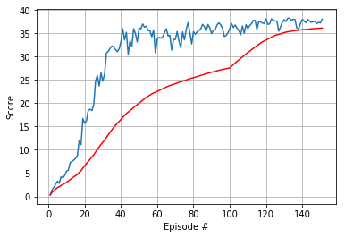

# Navigation

### Environment Details

In this environment, a double-jointed arm can move to target locations. A reward of +0.1 is provided for each step that the agent's hand is in the goal location. Thus, the goal of your agent is to maintain its position at the target location for as many time steps as possible.

The observation space consists of 33 variables corresponding to position, rotation, velocity, and angular velocities of the arm. Each action is a vector with four numbers, corresponding to torque applicable to two joints. Every entry in the action vector should be a number between -1 and 1.

The goal of the Reacher environment is to collect yellow bananas and 
avoid blue bananas. A reward of +1 is given for collecting a yellow banana
and a penalty of -1 is received for collecting a blue banana. 
The environment is solved if an average reward of +13 is received over the
last 100 episodes.

The action space is discrete. There are 4 possible actions:
0 - move forward, 1 - move backward, 2 - turn left, 3 - turn right.

The state is 37 dimensional corresponding to the velocity of the agent
and ray-based perception of objects around the agent's forward direction.

The goal of the Navigation environment is to collect yellow bananas and 
avoid blue bananas. A reward of +1 is given for collecting a yellow banana
and a penalty of -1 is received for collecting a blue banana. 
The environment is solved if an average reward of +13 is received over the
last 100 episodes.

The action space is discrete. There are 4 possible actions:
0 - move forward, 1 - move backward, 2 - turn left, 3 - turn right.

The state is 37 dimensional corresponding to the velocity of the agent
and ray-based perception of objects around the agent's forward direction.

### Installation Details

Clone the repository:

> git clone https://github.com/esghif/drlnd.git

Go to the project folder:

> cd drlnd/p1_navigation

Download the simulator from [Banana_Linux.zip](https://s3-us-west-1.amazonaws.com/udacity-drlnd/P1/Banana/Banana_Linux.zip) 
to the `p1_navigation` folder and unzip locally:

> unzip Banana_Linux.zip


### How to Run

Start the `conda` environment provided in the classroom:

> source activate drlnd

Start `jupyter` notebook:

> jupyter notebook


### Learning Algorithm 

The learning algorithm employed is Dueling Double Deep Q Network with Prioritized Experience Replay.
__Deep Q learning__ uses __experience replay__ and a __target network__ to stabilize learning.

__Experience replay__ refers to a the use of a memory of experiences i.e. tuples of state, action,
next_state  and reward that is sampled to create a mini-batch for gradient computation.

__Q learning__ uses the Bellman equation to learn a Q function for the environment.
The Bellman equation set an equality constraint between the Q value for a state-action pair
and the sum of the reward and expected value at the next state.
__Deep Q__ learning minimizes the mean squared error between the Q-value 
for the current state and action computed by the Q-network and the target 
value given by the Bellman equation.

The __target network__ is used to compute the value function at the next step and updated 
regularly, with values from the Q network. The fact that the __target network__ changes
slower is meant to increase the stability of network training by giving more stable targets
for learning.


The value function for a state is computed by taking the maxium over all actions of 
the Q-function. This can lead to an over-estimation of the value function, particularly,
at the start of training. For this reason in __Double Deep Q learning__ the action that 
maximizes the Q function is chosen using the training __not__ the target network.

__Duelling Deep Q learning__ uses a network architecture that estimates both the
value function and the advantage for each value-action pair. The Q-function is computed
as the sum of the value function and advantage. Only this final Q-function is used, and, thus
all learning algorithms remain unmodified.

__Experience replay__ weighs the samples in the buffer by the error in Q-function estimation.
The gradient estimation makes use of importance sampling to reweight each sample from the memory 
in order to reflect the probability of the sample given the used policy.

I used all the default hyperparameter values provided by the course materials.
For the prioritized experience replay memory there are two additional 
parameters: $$ \alpha $$ and $$ \beta $$ that can be viewed as a knob controlling
the amount of sampled weighing and importance sampling, respectively.


### Implementation Details

The network that implements the Q-function is a multi-layer fully connected neural network:
the first layer has 64 hidden layers, the second 32, the third layer bifurcates to compute
the value function and advantage separately as shown below.


```
        V = self.fc3_v(x)
        A = self.fc3_a(x)
        A = A - A.mean(1).unsqueeze(1)
        Q = V + A
```

I used the `PrioritizedReplayBuffer` class from the OpenAI baselines (included in the github repository) 
that uses segment trees to implement sampling proportional to the sample relevance.
The hyperparameters $$ \alpha $$ and $$ \beta $$ are modified according to a linear schedule
implemented in the class `LinearSchedule`. I experimented with different schedules, but was
unable to get any improvement. The final schedule is shown below:
```
        self.alpha = LinearSchedule([1.0, 1.0, 0.6], [0, 300, 500])        
        self.beta = LinearSchedule([1.0, 1.0, 0.4], [0, 300, 500])
```


### Plot Of Rewards



### Ideas for Future Development

Prioritized experience replay has not really worked for me so the first thing I would continue to 
investigate whether there is not still a programming error. 

### Other Remarks

I attempted to solve the learning-from-pixels problem. I ran into the problem, though, that 
there seems to be a memory leak in the simulator and learning gets really difficult with time.
Of course, there may be a problem in my code, also.