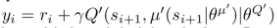
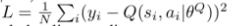
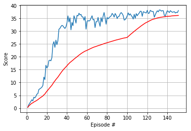

# Continuous Control on Reacher Environment 

### Learning Algorithm 


The learning algorithm employed is DDPG (Deep Deterministic Policy Gradient).
The algorithm is similar to A2C in that it uses a network to train
the policy (__actor__) and a separate netowrk to learn the Q-function (__critic__).

The __actor__ network takes in the state of the environment and returns an 
action represented as a vector of real numbers, i.e. the action is deterministic.
Reinforcement learning requires exploration of the policy function space, this
is realized in DDPG by adding noise to the output of the policy network.
The policy function is learned using the formula for deterministic policies 
found by D. Silver et.al in "Deterministic Policy Gradient Algorithms", and
reproduced below.


The __critic__ network takes the state of the environment together with
an action and returns the estimated value of the Q-function. 
The __critic__ network is trained using an experience replay buffer and
a target network as in DQN. The target network is used to estimate 
the Q-function value using the Bellman equation as shown below:



The local network is trained by minimizing the MSE (Mean Squared Error)
between the output of the __critic__ network and the estimated Q-value, 
as shown below:




The target network is updated after each learning step of the local network 
by a recursive approximation to a moving average
as shown below:

```python
        target_param.data.copy_(tau*local_param.data + (1.0-tau)*target_param.data)
```

The successful training of the agent is dependent on a few extra factors.
One is gradient clipping. I used gradient clipping with a threshold value of 0.1
for both the actor and the critic networks as shown below:


```python
        self.critic_optimizer.zero_grad()
        critic_loss.backward()
        torch.nn.utils.clip_grad_norm_(self.critic_local.parameters(), self.critic_grad_threshold)
        self.critic_optimizer.step()
        ...
        # Minimize the loss
        self.actor_optimizer.zero_grad()
        actor_loss.backward()
        torch.nn.utils.clip_grad_norm_(self.actor_local.parameters(), self.actor_grad_threshold)
        self.actor_optimizer.step()        
```

The second ingredient for the successful training is the gradual decrease of the number
of learning steps taken as the policy improves as shown below.

```python
    def step(self, states, actions, rewards, next_states, dones, eps=0):
        """Save experience in replay memory, and use random sample from buffer to learn."""
        # Save experience / reward
        for state, action, reward, next_state, done in zip(states, actions, rewards, next_states, dones):
            self.memory.add(state, action, reward, next_state, done)

        # Learn, if enough samples are available in memory
        if eps < 10:
            self.mod = 1
            self.repeat = 20
        elif eps < 20:
            self.mod = 1
            self.repeat = 10
        elif eps < 100:
            self.mod = 1
            self.repeat = 2
        else:
            self.mod = 10
            self.repeat = 2  
```


### Plot Of Rewards



### Ideas for Future Development

The DDPG algorithm seems to be very well suited to learn a policy that solves 
the Reacher environment, even though it is sensitive to the random initialization seed.


I used relatively big fully connected networks for both the actor and the critic, I also tried
smaller networks, but contrary to experience from the P1 rpoject and also some online anecdotes 
the larger network performed better.

Another possible approach to varying the number of network parameter upadtes per step could be decreasing 
the standard deviation of the action noise.

PPO seems to be an alternative to DDPG for learning agents for continuous action spaces.
As opposed to DDPG, PPO uses the experience buffer to store entire rollouts and estimates the local
advantage value by Generalized Advantage Estimation, which combines Bellman constraints of different
lengths. 


