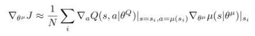
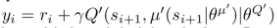
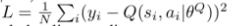
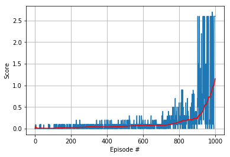

# Multi-Agent Learning on the Tennis Environment


### Learning Algorithm 


The learning algorithm employed is DDPG (Deep Deterministic Policy Gradient).
The algorithm is similar to A2C in that it uses a network to train
the policy (__actor__) and a separate netowrk to learn the Q-function (__critic__).

The __actor__ network takes in the state of the environment and returns an 
action represented as a vector of real numbers, i.e. the action is deterministic.
Reinforcement learning requires exploration of the policy function space, this
is realized in DDPG by adding noise to the output of the policy network.
The policy function is learned using the formula for deterministic policies 
found by D. Silver et.al in "Deterministic Policy Gradient Algorithms", and
reproduced below.



The __critic__ network takes the state of the environment together with
an action and returns the estimated value of the Q-function. 
The __critic__ network is trained using an experience replay buffer and
a target network as in DQN. The target network is used to estimate 
the Q-function value using the Bellman equation as shown below:



The local network is trained by minimizing the MSE (Mean Squared Error)
between the output of the __critic__ network and the estimated Q-value, 
as shown below:




The target network is updated after each learning step of the local network 
by a recursive approximation to a moving average
as shown below:

```python
        target_param.data.copy_(tau*local_param.data + (1.0-tau)*target_param.data)
```

The successful training of the agent is aided by gradient clipping, modification
of update steps after each simulation of an episode and decrease of standard deviation
of the noise used by the DDPG algorithm for exploration.


The schedules of noise decrease and learning steps are given by the code below.

```python
def sigma_schedule(eps, score):    
    if eps < 1000:
        sigma = 1. - eps * (.9/1000)    
    else:
        sigma = 0.1 - (eps-1000) * (.05/1000)
    return sigma    

def rep_schedule(eps, score):
    if eps < 600:
        rep = 20
    elif eps < 1100:
        rep = 10
    else:
        rep = 5

    return rep
```


### Plot Of Rewards



### Ideas for Future Development

Inspired by [MADDPG](https://arxiv.org/pdf/1706.02275.pdf) i would try 
to modify the critic network to take 2 actions as input, i.e. the action 
of both agents given the current state. In this way the critic network 
that is used only in training has information regarding both 
agents during training.


